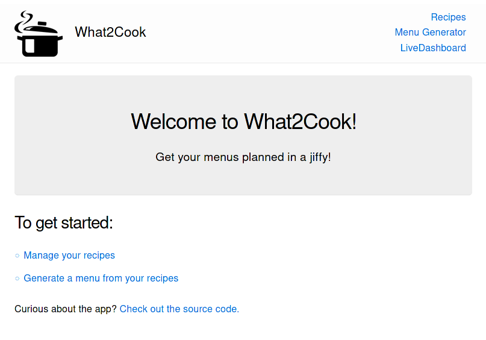
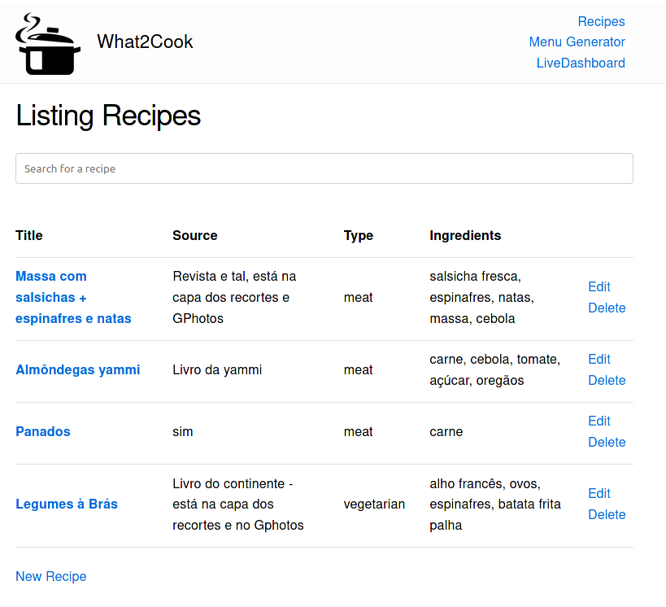
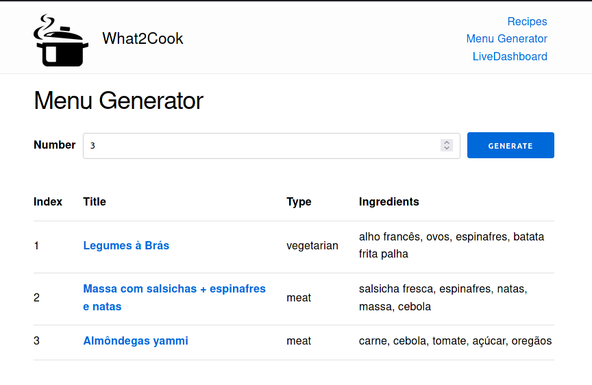

# What2Cook

Tired of planning meals by yourself? Try What2Cook!

## Overview

What2Cook is a (very) simple webapp that aims to streamline the meal planning process.  
Its purpose is to act as both a repository of your favorite recipes, as well as a simple way to plan out the following meals.

For example, during a week-end one may generate a menu for the upcoming week and buy groceries according to the planned menu. This way, there is no need to _"wing it"_ in terms of meal prep/planning, especially during a possibly tiring work week!

## Rationale and Goals

This project was created out of my simple need to simplify meal planning with my family.
Previously, we always had to think ahead or come up with a recipe on the spot.

Hopefully this application solves this issue, by generating menus for the desired upcoming time frame.

As such, this app has as a core goal **ease of use**, such that even non-technical users are able to make use of it.  
Furthermore, the concept of this application is also of **data governance**: although there may already be services that provide similar features, What2Cook aims to be a self-deployed and open-source project, so that those who manage the service are able to remain in control of their data.  
Finally, another core pillar of this project's development is **learning**. It is a simple idea and real need turned into a software development project that aims to focus on features as well as code quality, starting as a simple path to a usable MVP, while still aiming to be a good reference (if not at least for myself) of a relatively simple web project. With What2Cook I wish to once again familiarise myself with software and web development (especially in Elixir, Phoenix and WebSockets via LiveView) as well as deployments, deployment management, continuous integration, and anything that may make sense to touch upon while developing it :)

## Showcase

Some of the app's pages:

* Homepage:

* Recipe list and management:

* Menu generation:

## Deployment

What2Cook is a [Phoenix](https://www.phoenixframework.org/) app, so their [deployment docs](https://hexdocs.pm/phoenix/deployment.html) are the best place to start.

[fly.io](https://fly.io/) and [Heroku](https://www.heroku.com/) may also significantly streamline deployment with ready-to-go templates.
